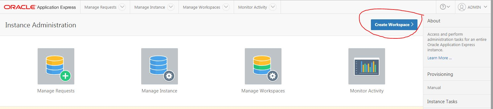
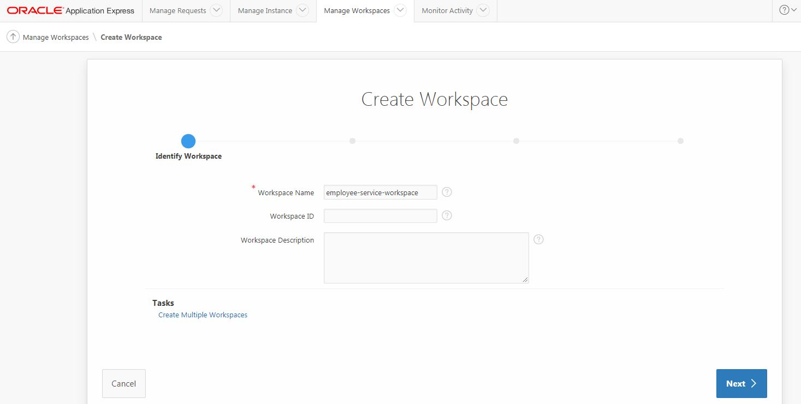
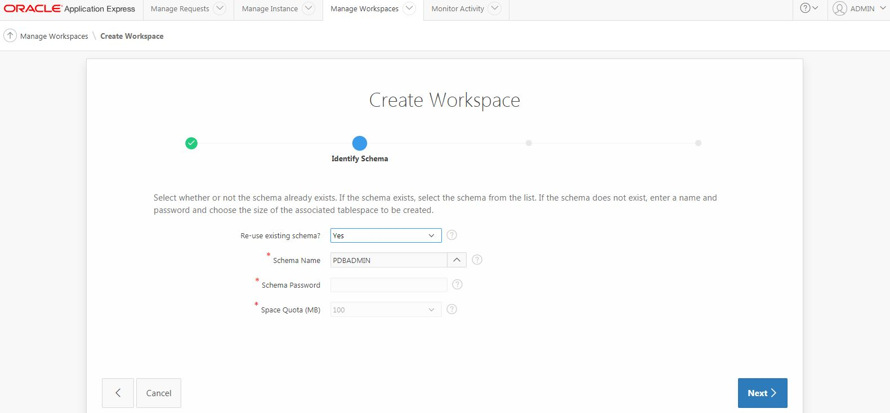
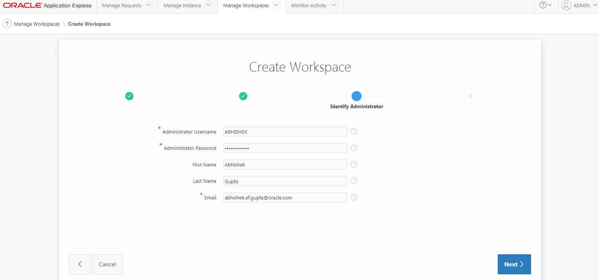
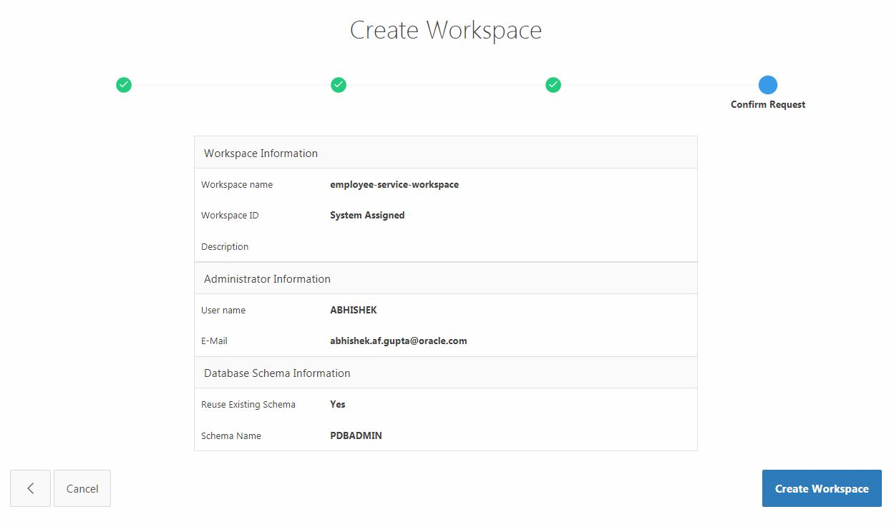
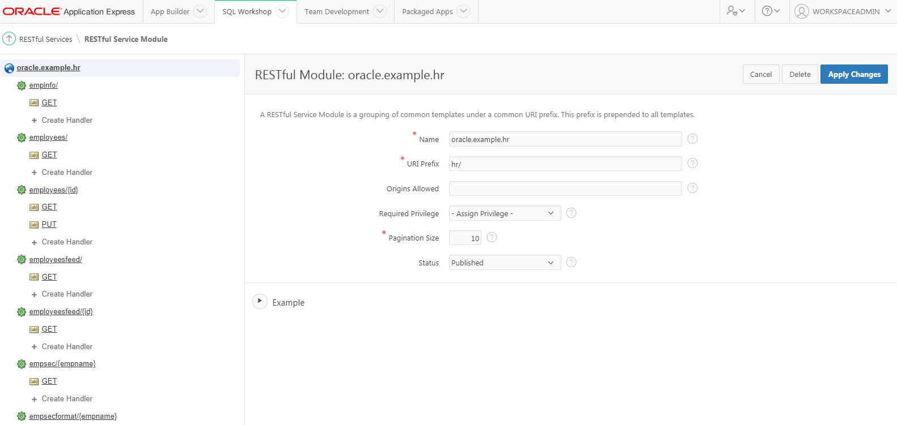

# Fn functions with Oracle REST Data Services (ORDS) on Oracle Database Cloud

Fn functions interact with the REST endpoints defined within a RESTful service in ORDS

- driver agnostic - no dependency on JDBC etc.
- language agnostic - this example is Java based, but you can use HTTP client in any language (which Fn supports)
- `Serverless` approach !

## Set and configure Oracle Database Cloud Service

Please follow the documentation - https://docs.oracle.com/en/cloud/paas/database-dbaas-cloud/csdbi/create-db-deployment-overview.html

## Configure APEX

- Access APEX console - https://docs.oracle.com/en/cloud/paas/database-dbaas-cloud/csdbi/access-apex-console.html
- Create new workspace - https://docs.oracle.com/database/apex-5.1/AEADM/creating-workspaces.htm#GUID-4A0C462F-6FC5-4117-9BC7-B24E19EE790E

- Login to your workspace with the user credentials you just configured
- [Access the RESTful services module](https://docs.oracle.com/database/apex-5.1/AEUTL/accessing-RESTful-services.htm#AEUTL448) and [install the sample RESTful service](https://docs.oracle.com/database/apex-5.1/AEUTL/managing-RESTful-service-modules.htm#AEUTL-GUID-C2D70748-ED0E-4735-A417-9CBA97816654)

- Note down the base URL for your RESTful service. The format is as follows - `https://<DBCS_IP>/ords/pdb1/<WORKSPACE_NAME>/hr/` e.g. `https://129.150.196.175/ords/pdb1/employee-service-workspace/hr/` 
- explore [details in the documentation](https://docs.oracle.com/database/apex-5.1/AEUTL/how-to-create-RESTful-service-module-example.htm#AEUTL29134)

## Sanity test

Now that you've set up the RESTful service, test it out using curl. Get all employees using the endpoint `BASE_URL/employees` e.g. `https://129.150.196.175/ords/pdb1/employee-service-workspace/hr/employees` 

## Bootstrap Fn

- `fn start`

Configure Docker

- `docker login` (use your docker registry credentials)
- `export FN_REGISTRY=<name of your docker repository>`

> your function docker image name will end up being - `<docker repo name>/<function name in func.yaml>:<version in func.yaml>`

## Deploy app

- `git clone https://github.com/abhirockzz/fn-oracledb-ords-sample`
- `cd fn-oracledb-ords-sample`
- replace `ORDS_REST_SERVICE_ENDPOINT` environment variable in the `config` section of `func.yaml` - this is the URL which was mentioned in the previous section e.g. `https://129.150.196.175/ords/pdb1/employee-service-workspace/hr/` 
- `fn -v deploy --all` (`-v` will activate verbose mode)

> adding `--local` to `fn deploy` will build & push docker images locally (and run it from there). Remove it if you want use a dedicated/external Docker registry

All your functions should now be deployed. Check them using `fn inspect app fn-oracledb-ords-app` and `fn list routes fn-oracledb-ords-app`

## Test

Use Fn CLI to test with `fn call` command

### Get all employees

- `fn call fn-oracledb-ords-app /read` (to fetch all employees)

You'll get back a JSON response (trimmed for brevity)

	{
	    "next": {
	        "$ref": "https://w.x.y.z/ords/pdb1/rest-workspace/hr/employees/?page=1"
	    },
	    "items": [
	        {
	            "uri": {
	                "$ref": "https://w.x.y.z/ords/pdb1/rest-workspace/hr/employees/7369"
	            },
	            "rn": 1,
	            "empno": 7369,
	            "ename": "SMITH",
	            "job": "CLERK",
	            "hiredate": "1980-12-17T00:00:00Z",
	            "mgr": 7902,
	            "sal": 800,
	            "deptno": 20
	        },
	        {
	            "uri": {
	                "$ref": "https://w.x.y.z/ords/pdb1/rest-workspace/hr/employees/7499"
	            },
	            "rn": 2,
	            "empno": 7499,
	            "ename": "ALLEN",
	            "job": "SALESMAN",
	            "hiredate": "1981-02-20T00:00:00Z",
	            "mgr": 7698,
	            "sal": 1600,
	            "comm": 300,
	            "deptno": 30
	        }
			...........
	    ]
	}

### Get employee by ID

- `echo -n 7369 | fn call fn-oracledb-ords-app /read` (to fetch employee by ID)

JSON response

	{
	    "empno": 7369,
	    "ename": "SMITH",
	    "job": "CLERK",
	    "mgr": 7902,
	    "hiredate": "1980-12-17T00:00:00Z",
	    "sal": 800,
	    "deptno": 20
	}

### Update

`echo -n '{"empno":7654,"ename":"MARTIN","job":"SALESMAN","mgr":7698,"hiredate":"1981-09-28T00:00:00Z","sal":12500,"comm":1400,"deptno":30}' | fn call fn-oracledb-ords-app /update`

Pass the updated info via a JSON payload (in this case, salary and commission have been bumped up!). You will get back a JSON response e.g.

	{
	    "empno": 7654,
	    "ename": "MARTIN",
	    "job": "SALESMAN",
	    "mgr": 7698,
	    "hiredate": "1981-09-28T00:00:00Z",
	    "sal": 12500,
	    "comm": 1400,
	    "deptno": 30
	}